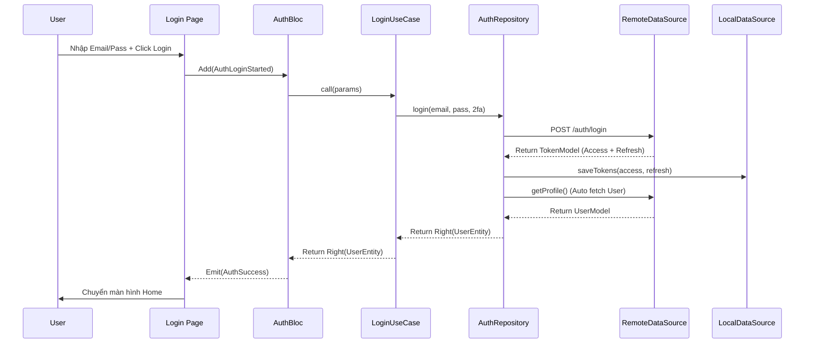
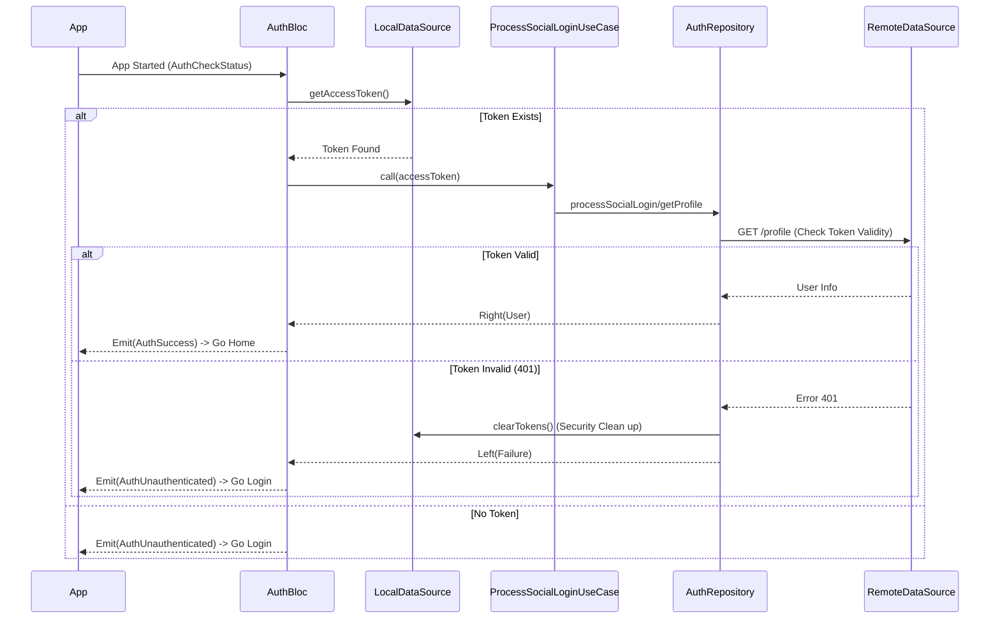

# PHÂN TÍCH CHUYÊN SÂU & ĐÁNH GIÁ HỆ THỐNG AUTHENTICATION

Tài liệu này cung cấp cái nhìn chi tiết, chuyên sâu về kiến trúc, luồng dữ liệu (Data Flow) và đánh giá chất lượng mã nguồn (Code Quality) của module `Auth` trong dự án `app_fe_ecomerce`.

---

## 1. Tổng Quan Kiến Trúc (Architectural Overview)

Dự án áp dụng mô hình **Clean Architecture** kết hợp với **BLoC Pattern**. Đây là tiêu chuẩn vàng cho các ứng dụng Flutter quy mô lớn, đảm bảo khả năng mở rộng (Scalability), bảo trì (Maintainability) và kiểm thử (Testability).

### Sơ đồ phân tầng:

```mermaid
graph TD
    UI[Presentation Layer (UI)] -->|Events| Bloc[BLoC (State Management)]
    Bloc -->|Call| UC[Domain Layer (UseCases)]
    UC -->|Interface| Repo[Repository Interface]
    Repo -.->|Implementation| RepoImpl[Data Layer (Repository Impl)]
    RepoImpl -->|Remote| RemoteDS[Remote DataSource (API)]
    RepoImpl -->|Local| LocalDS[Local DataSource (Storage)]
```

### Chi tiết các tầng trong module:

| Tầng (Layer)     | Thư mục         | Nhiệm vụ chính                                                                                                             | Đánh giá                                                                          |
| :--------------- | :-------------- | :------------------------------------------------------------------------------------------------------------------------- | :-------------------------------------------------------------------------------- |
| **Domain**       | `domain/`       | Chứa **Entities** (Class thuần dũ liệu) và **UseCases** (Logic nghiệp vụ). Định nghĩa _những gì_ app làm được.             | **Chuẩn**. Không phụ thuộc framework bên ngoài. Tách biệt hoàn toàn.              |
| **Data**         | `data/`         | Chứa **Models** (JSON parsing), **DataSources** (API/DB) và **Repo Implementation**. Quyết định _làm thế nào_ lấy dữ liệu. | **Tốt**. Sử dụng `Retrofit` pattern (thủ công qua Dio) và `FlutterSecureStorage`. |
| **Presentation** | `presentation/` | Chứa **Bloc**, **Pages**, **Widgets**. Nhận input từ User và render State.                                                 | **Tốt**. Logic tách biệt nhờ BLoC.                                                |

---

## 2. Phân Tích Công Nghệ & Thư Viện (Tech Stack Analysis)

Các package được lựa chọn đều phục vụ mục đích cụ thể và chuyên nghiệp:

1.  **`flutter_secure_storage` (Thay vì `shared_preferences`)**:
    - **Tại sao dùng?**: Token đăng nhập (Access Token, Refresh Token) là dữ liệu nhạy cảm. `SharedPreferences` chỉ lưu file XML/Plist thuần, dễ bị hack nếu root máy. `FlutterSecureStorage` lưu vào Keystore/Keychain mã hóa của hệ điều hành.
    - **Đánh giá**: **RẤT TỐT (EXCELLENT)**. Bảo mật cao.

2.  **`fpdart` (`Either<Failure, Success>`)**:
    - **Tại sao dùng?**: Thay thế cơ chế `try-catch` truyền thống. Ép buộc lập trình viên phải xử lý lỗi ở mọi nơi gọi hàm.
    - **Đánh giá**: **CHUẨN (BEST PRACTICE)**. Giúp code an toàn (Type-safe access), tránh crash ngầm.

3.  **`injectable` & `get_it` (Dependency Injection)**:
    - **Tại sao dùng?**: Giúp Decouple (gỡ rối) sự phụ thuộc giữa các class. Class A không new Class B trực tiếp mà nhận qua Constructor.
    - **Đánh giá**: **CẦN THIẾT**. Cực kỳ quan trọng để viết Unit Test và quản lý vòng đời object (Singleton/Factory).

4.  **`flutter_bloc`**:
    - **Tại sao dùng?**: Quản lý state theo luồng sự kiện (Event-Driven). Rõ ràng input (Event) và output (State).

---

## 3. Chi Tiết Luồng Hoạt Động (Detailed Workflows)

### 3.1. Quy Trình Đăng Nhập (Login Flow)



**Điểm nhấn kỹ thuật**:

- Repo tự động lưu Token ngay sau khi gọi API thành công -> UI không cần quan tâm việc lưu token.
- Repo tự động gọi tiếp `getProfile` -> Đảm bảo khi login xong là có đầy đủ thông tin User ngay.

### 3.2. Quy Trình Tự Động Đăng Nhập (Auto-Login / Session Restore)



**Đánh giá "Zero Trust"**:

- Hệ thống **không tin tưởng tuyệt đối** vào token lưu dưới máy. Nó luôn thử gọi API (`getProfile`) để xác thực xem token đó còn sống hay không. Nếu chết (401), nó tự clear và bắt đăng nhập lại. Đây là cách làm rất bảo mật.

---

## 4. Giải Thích Cấu Trúc File & Nhiệm Vụ

Giải đáp câu hỏi: _"File nào làm gì? Tại sao lại tạo ra như thế?"_

1.  **`auth_remote_datasource.dart`**: Logic "Thô".
    - Chỉ biết gọi API và trả về Model thô (JSON object).
    - Không xử lý logic nghiệp vụ, không bắt lỗi logic, chỉ throw exception nếu mạng lỗi.
2.  **`auth_local_datasource.dart`**: Logic "Kho bãi".
    - Chuyên trách việc cất giữ Token vào két sắt (Secure Storage).
3.  **`auth_repository_impl.dart`**: "Người điều phối" (Brain of Data Layer).
    - Kết hợp Remote và Local.
    - Ví dụ logic Login: Gọi Remote lấy token -> Đưa Local cất token -> Gọi Remote lấy User -> Trả về Domain.
    - Biến đổi Exception thô (từ Dio) thành Failure chuẩn (của Domain) để UI dễ hiển thị lỗi.
4.  **`usecases/*.dart`**: "Hành động đơn lẻ".
    - Mỗi class là 1 hành động (Login, Register, Logout).
    - Tại sao cần? Để tuân thủ Single Responsibility Principle. Khi cần sửa logic Login, chỉ cần mở file `LoginUseCase`, không ảnh hưởng Register. Dễ tái sử dụng ở nơi khác nếu cần.
5.  **`auth_bloc.dart`**: "Cầu nối UI".
    - Biến đổi sự kiện từ người dùng (bấm nút) thành Command gọi xuống bên dưới.
    - Quản lý các trạng thái phức tạp: Đang tải (Loading), Thành công (Success), Lỗi (Failure), OTP Sent...

---

## 5. Điểm Cần Cải Thiện (Recommendations)

Dù hệ thống đã rất tốt, vẫn còn vài điểm có thể nâng cấp để trở nên "hoàn hảo":

1.  **Interceptor chưa tự động Refresh Token**:
    - **Hiện trạng**: File `auth_interceptor.dart` dòng 35 đang để `TODO: Implement refresh token logic`. Khi token hết hạn (401), app hiện tại sẽ logout user.
    - **Cải thiện**: Cần implement logic: Khi gặp 401 -> Giữ lại request -> Gọi API `refresh-token` -> Lấy token mới -> Retry lại request cũ. Điều này giúp trải nghiệm người dùng mượt mà hơn, không bị văng ra login liên tục.

2.  **Return Type của Register**:
    - **Hiện trạng**: `AuthRemoteDataSource.register` đang trả về `TokenModel` (theo code đọc được) nhưng chưa rõ ràng backend có trả về token ngay lúc register không.
    - **Cải thiện**: Xác nhận rõ với Backend. Nếu Backend không trả token lúc Register, luồng Auto-login sau Register sẽ thất bại.

3.  **Mapper**:
    - Hiện tại `UserModel` kế thừa `UserEntity`. Đây là cách làm nhanh và gọn. Tuy nhiên trong các dự án Strict Clean Architecture, người ta thường tách biệt và dùng Mapper để chuyển đổi `UserModel` -> `UserEntity` để Domain hoàn toàn không biết gì về JSON annotation. Nhưng với Flutter, cách hiện tại là chấp nhận được và thực dụng.

## 6. Kết Luận

Hệ thống Authentication của `app_fe_ecomerce` được xây dựng rất **bài bản, bảo mật và hiện đại**. Source code thể hiện trình độ kỹ thuật tốt, tuân thủ nghiêm ngặt các nguyên tắc thiết kế phần mềm.

- **Clean Architecture**: ĐẠT Chuẩn.
- **Security**: TỐT (Dùng Secure Storage).
- **Scalability**: TỐT (Dễ thêm tính năng mới).
- **User Experience**: TỐT (Có Auto Login), sẽ hoàn hảo nếu thêm Auto Refresh Token.

---

_Tài liệu được phân tích và biên soạn bởi AI Senior Developer._
