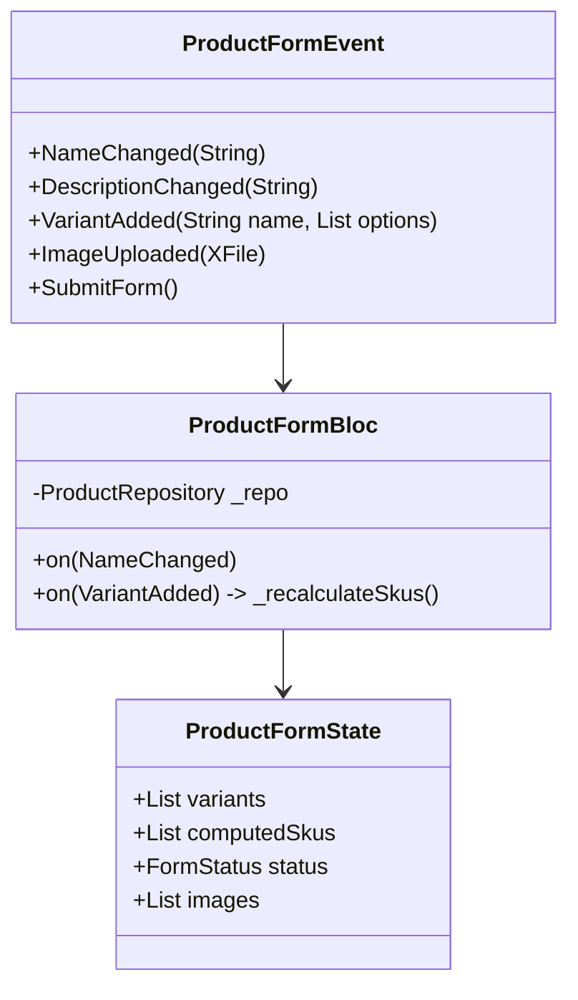

# BÁO CÁO PHÂN TÍCH KỸ THUẬT CHUYÊN SÂU (TECHNICAL DEEP DIVE)

**Dự án:** app_fe_ecomerce
**Module:** Product & Category
**Tiêu chuẩn đánh giá:** Clean Architecture, SOLID, Performance, Scalability.

---

## 1. PHÂN TÍCH KIẾN TRÚC TỔNG THỂ (ARCHITECTURE DISSECTION)

### Mô hình luồng dữ liệu (Data Flow Diagram)

Dưới đây là luồng đi của dữ liệu trong dự án của bạn (Happy Path):

```mermaid
graph TD
    User((User)) --> UI[Presentation Layer\n(Pages, Widgets)]
    UI -->|Event/Call| BLOC[State Management\n(Bloc/Cubit)]
    BLOC -->|UseCase| DOMAIN[Domain Layer\n(Business Logic)]
    DOMAIN -->|Interface| REPO_I[Repository Interface]
    REPO_I -.->|Implement| REPO_IMPL[Data Layer\n(Repository Impl)]
    REPO_IMPL -->|Call| DS[Remote DataSource]
    DS -->|Dio Request| API[External API]

    subgraph "Tại sao cấu trúc này?"
    direction TB
    Explanation1[Tách biệt UI và Logic]
    Explanation2[Dễ dàng Test Unit]
    Explanation3[Độc lập với API/DB]
    end
```

### Tại sao lại chia tầng như vậy?

1.  **Presentation (UI + Bloc)**: Chỉ chịu trách nhiệm hiển thị và điều hướng. Nếu logic kinh doanh thay đổi (VD: đổi cách tính giá), UI không cần sửa đổi.
2.  **Domain (UseCase + Entities)**: Đây là "trái tim" của ứng dụng. Nó chứa các luật bất biến.
    - _Tại sao cần UseCase?_ Để đóng gói một hành động cụ thể (VD: `GetDailyDiscover`). Nếu sau này logic "Daily Discover" thay đổi (cần filter thêm user preference), bạn chỉ cần sửa 1 chỗ này, không ảnh hưởng tới Repo hay UI.
3.  **Data (Repository Impl + DataSource)**:
    - _Tại sao tách Repo và DataSource?_ `Repository` chịu trách nhiệm chọn nguồn dữ liệu (Cache hay Network). `DataSource` chỉ đơn thuần là gọi API. Sự phân tách này giúp bạn dễ dàng thêm tính năng Offline Mode sau này mà không đập đi xây lại.

---

## 2. ĐÁNH GIÁ CHI TIẾT TỪNG TÍNH NĂNG (FEATURE DEEP DIVE)

### TÍNH NĂNG 1: HIỂN THỊ TRANG CHỦ & DANH MỤC (READ FLOW)

**File liên quan:** `HomeBloc`, `GetHomeDataUseCase`, `CategoryRepository`, `ProductRepository`.

#### Phân Tích Kỹ Thuật:

- **Aggregation Pattern (Gộp dữ liệu):**
  - Trong `GetHomeDataUseCase`, bạn sử dụng `Future.wait`:
    ```dart
    final results = await Future.wait([
      homeRepository.getBanners(),
      categoryRepository.getCategories(),
      productRepository.getProducts(...),
    ]);
    ```
  - **Tại sao tốt?** Thay vì chờ tuần tự (Waterfall: gọi banner -> xong -> gọi category), kỹ thuật này gửi 3 request song song. Giảm thời gian chờ từ `T1 + T2 + T3` xuống còn `Max(T1, T2, T3)`. Đây là best practice về hiệu năng.

- **Error Handling (Xử lý lỗi):**
  - Sử dụng `fpdart` (`Either`). Kỹ thuật này coi lỗi là một giá trị (value) chứ không phải ngoại lệ (exception).
  - **Lợi ích:** Bắt buộc lập trình viên phải xử lý cả 2 trường hợp Lỗi và Thành công ngay tại lúc code, tránh việc quên `try-catch` dẫn đến crash app ngầm.

#### Đánh giá: ⭐ 9.5/10 (Xuất sắc)

Logic rất sạch (Clean), tối ưu hiệu năng tốt.

---

### TÍNH NĂNG 2: THÊM SẢN PHẨM MỚI (WRITE FLOW)

**File liên quan:** `AddProductPage.dart`, `ProductRemoteDataSource`.

#### Phân Tích Kỹ Thuật (Vấn đề hiện tại):

Màn hình này đang gánh quá nhiều trách nhiệm (Violation of Single Responsibility Principle).

**1. Logic Algorithm tạo biến thể (SKU Permutation):**

- **Hiện tại:** Hàm `_buildSkuValues` (dòng 187) và `_updateSkuList` (dòng 206) đang nằm trong UI.
- **Cơ chế:** Dùng vòng lặp lồng nhau để tạo tổ hợp (Cartesian Product).
  - Ví dụ: Màu [Đỏ, Xanh] x Size [S, M] -> [Đỏ-S, Đỏ-M, Xanh-S, Xanh-M].
- **Vấn đề:** Nếu một sản phẩm có 3 thuộc tính (Màu, Size, Chất liệu) mỗi cái 5 tùy chọn -> 5x5x5 = 125 SKUs. Hàm này chạy trên UI Thread sẽ gây giật lag (Jank) giao diện khi user nhập liệu.

**2. Quản lý trạng thái Form:**

- **Hiện tại:** Dùng 1 loạt `TextEditingController` rời rạc (`_nameController`, `_priceController`...).
- **Hệ quả:** Dễ bị lỗi đồng bộ dữ liệu. Khi user xóa 1 variant, việc update lại list SKU controllers rất phức tạp và dễ gây bug (controller bị dispose sai chỗ, memory leak).

**3. Dependency Injection sai cách:**

- Code: `GetIt.I<ProductRepository>()` gọi ngay trong hàm `_submit`.
- **Tại sao tệ?** Biến View thành Smart Component (biết quá nhiều). View chỉ nên biết gởi event "Tôi muốn tạo sản phẩm", còn việc tạo thế nào, gọi API gì là việc của Bloc.

#### Đánh giá: ⭐ 4.0/10 (Cần Refactor Gấp)

Tính năng chạy được nhưng code "bẩn" (Spaghetti Code), khó bảo trì và mở rộng.

---

## 3. GIẢI PHÁP REFACTOR (STEP-BY-STEP)

Để đưa tính năng **Thêm Sản Phẩm** về đúng chuẩn Clean Architecture, tôi đề xuất thiết kế lại như sau:

### Bước 1: Tạo `ProductFormBloc`

Tách toàn bộ logic ra khỏi UI.



### Bước 2: Chuyển Logic Algorithm về Domain hoặc Helper

Đưa hàm `_buildSkuValues` ra một class riêng, ví dụ `SkuGenerator` (Pure Dart Class), có thể chạy trong `compute` (Isolate) nếu số lượng variant lớn > 100.

### Bước 3: Đơn giản hóa UI (`AddProductPage`)

UI lúc này sẽ cực kỳ gọn nhẹ:

```dart
// Thay vì logic, chỉ còn:
BlocBuilder<ProductFormBloc, ProductFormState>(
  builder: (context, state) {
    return Column(
      children: [
        // Hiển thị list variants từ state
        VariantList(variants: state.variants),
        // Hiển thị list SKU đã tính toán sẵn từ state
        SkuTable(skus: state.computedSkus),
        PrimaryButton(
           onPressed: () => context.read<ProductFormBloc>().add(SubmitForm())
        )
      ]
    );
  }
)
```

---

## 4. CÔNG CỤ & PACKAGES (TECHNICAL STACK REVIEW)

| Package                    | Vai trò trong dự án    | Đánh giá tính phù hợp                                                                                     |
| :------------------------- | :--------------------- | :-------------------------------------------------------------------------------------------------------- |
| **flutter_screenutil**     | Responsive UI          | **Cần thiết**. Đảm bảo app hiển thị tốt trên nhiều kích thước màn hình thiết bị Android/iOS.              |
| **injectable**             | Code Generation cho DI | **Tuyệt vời**. Giúp tránh boilerplate code khi đăng ký service, giảm rủi ro quên đăng ký (Runtime Error). |
| **cached_network_image**   | Image Caching          | **Bắt buộc**. Không có nó, list sản phẩm sẽ load laị ảnh liên tục khi scroll, tốn 4G và giật lag.         |
| **pinput**                 | OTP Input              | Tốt, chuyên biệt cho OTP.                                                                                 |
| **flutter_secure_storage** | Lưu Token              | **An toàn**. Lưu Token mã hóa vào Keychain/Keystore thay vì SharedPreferences (plain text).               |

---

## 5. KẾT LUẬN CUỐI CÙNG

Dự án có nền tảng **Core** và **Read features** rất vững chắc. Bạn đã nắm vững lý thuyết Clean Architecture. Tuy nhiên, ở các form nhập liệu phức tạp (**Write features**) như `AddProductPage`, bạn đang bị cuốn vào việc xử lý logic UI quá nhiều.

**Action Item ưu tiên:**

1.  Dừng việc thêm tính năng mới cho `AddProductPage`.
2.  Tạo thư mục `lib/features/product/presentation/bloc/add_product/`.
3.  Di chuyển logic từ `AddProductPage` sang `AddProductBloc`.
4.  Viết Unit Test cho `AddProductBloc` (đặc biệt là logic sinh SKU tự động).
