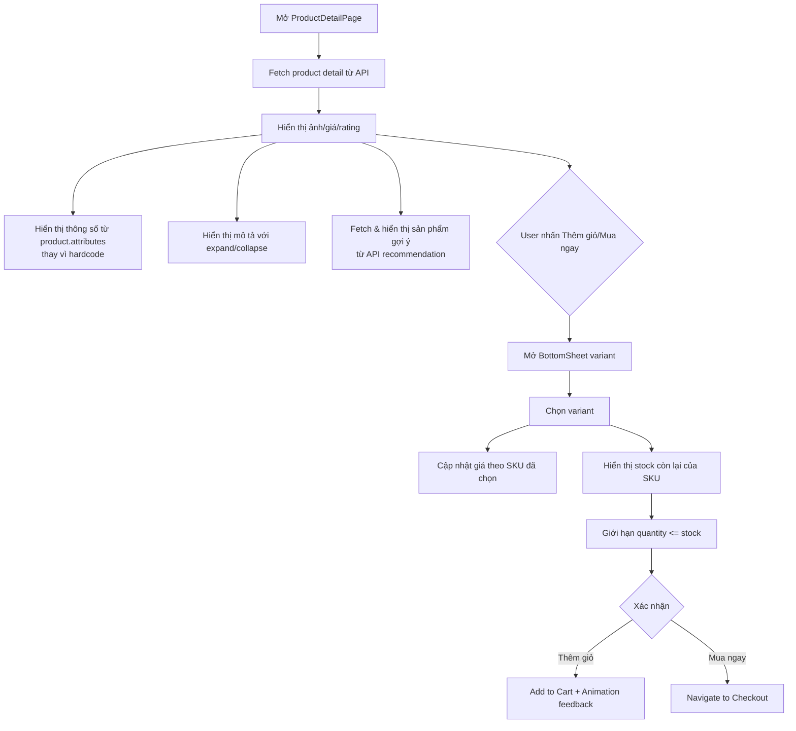
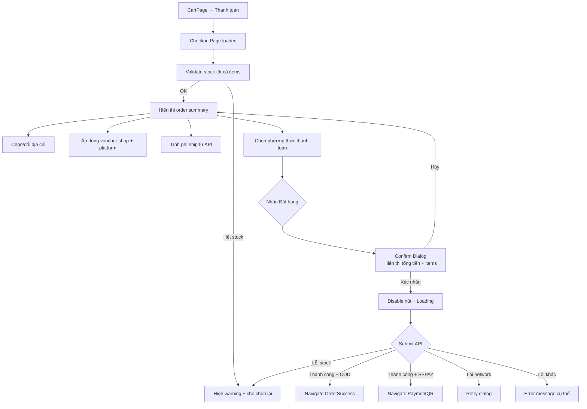
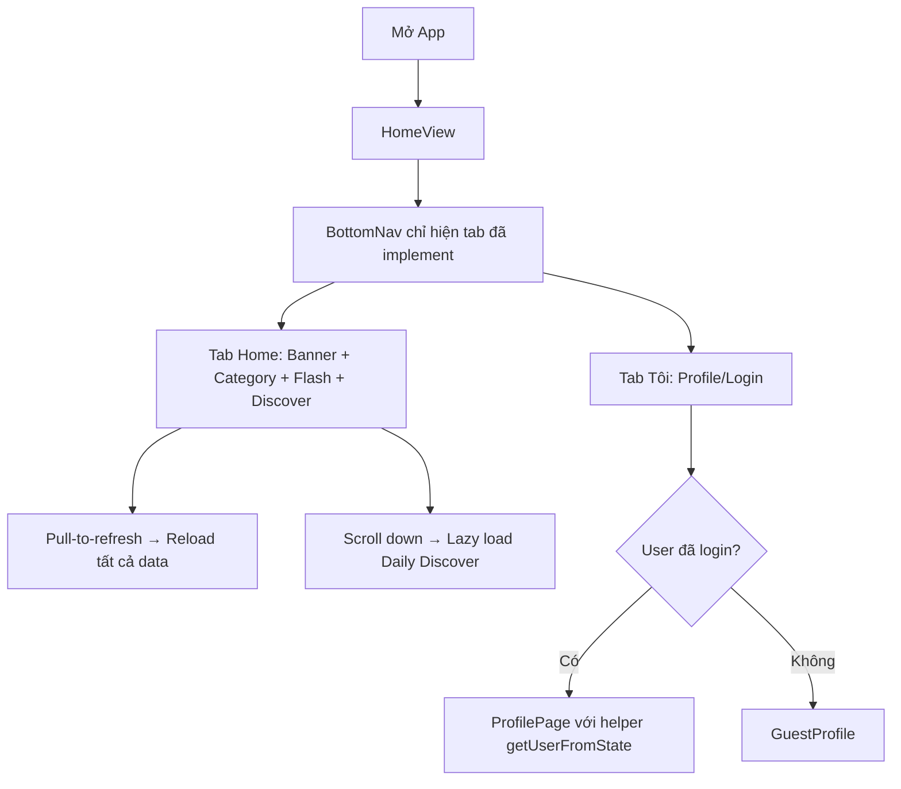
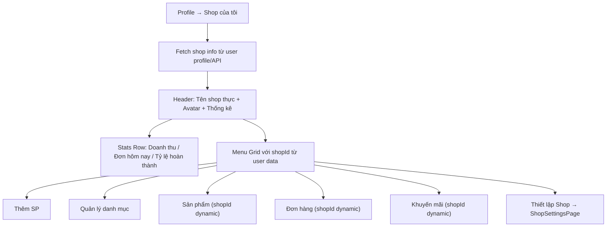
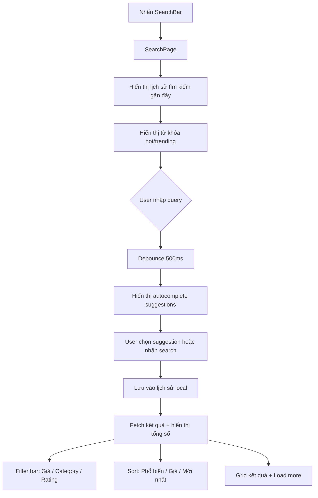
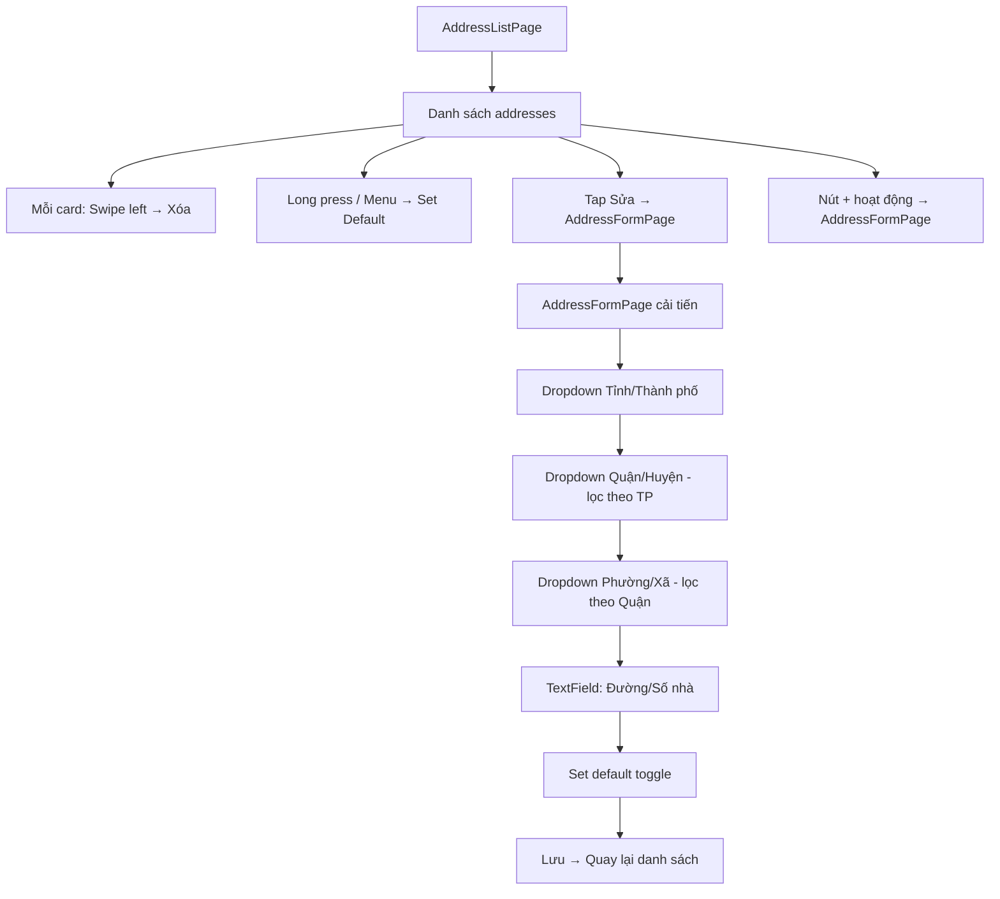

# 📋 Báo Cáo Đánh Giá Chi Tiết — E-Commerce Flutter App

> **Ngày phân tích:** Phân tích toàn bộ 15 module tính năng  
> **Phương pháp:** Review code presentation layer, logic flow, UX patterns

---

## 1. Bảng Đánh Giá Tổng Quan

> [!NOTE]
> Điểm đánh giá theo thang 1-5 ⭐ (1 = Rất yếu, 5 = Xuất sắc)  
> **Mức ưu tiên cải thiện:** 🔴 Cao | 🟡 Trung bình | 🟢 Thấp (Chấp nhận được)

| # | Module | UX/UI Flow | Xử lý lỗi | Hiệu suất | Bảo mật | Độ hoàn thiện | Ưu tiên | Ghi chú |
|---|--------|-----------|-----------|-----------|---------|--------------|---------|---------|
| 1 | **Product Detail** | ⭐⭐ | ⭐⭐ | ⭐⭐⭐ | ⭐⭐⭐ | ⭐⭐ | 🔴 | Variant hardcode, spec hardcode, recommendations giả, không check stock |
| 2 | **Checkout** | ⭐⭐⭐ | ⭐⭐ | ⭐⭐ | ⭐⭐⭐ | ⭐⭐⭐ | 🔴 | Thiếu validation stock, không confirm trước submit, chưa handle network errors |
| 3 | **Home Page** | ⭐⭐⭐ | ⭐⭐ | ⭐⭐⭐ | ⭐⭐⭐ | ⭐⭐ | 🔴 | 3 tab trống (Mall, Live, Thông báo), kéo user từ profile phức tạp |
| 4 | **My Shop (Seller)** | ⭐⭐ | ⭐ | ⭐⭐⭐ | ⭐⭐ | ⭐⭐ | 🔴 | shopId hardcode=1, thiết lập shop chưa có, không hiển thị thống kê |
| 5 | **Search** | ⭐⭐⭐ | ⭐⭐⭐ | ⭐⭐⭐ | ⭐⭐⭐ | ⭐⭐ | 🟡 | Không lưu lịch sử, không suggest, không filter/sort |
| 6 | **Cart** | ⭐⭐⭐⭐ | ⭐⭐⭐ | ⭐⭐⭐ | ⭐⭐⭐ | ⭐⭐⭐ | 🟡 | Thiếu confirm xóa nhiều, không validate stock trước checkout |
| 7 | **Address** | ⭐⭐⭐ | ⭐⭐⭐ | ⭐⭐⭐ | ⭐⭐⭐ | ⭐⭐⭐ | 🟡 | Nhập tay thành phố/quận (nên dropdown), thiếu xóa, nút "+" chưa hoạt động |
| 8 | **Auth (Login/Register)** | ⭐⭐⭐⭐ | ⭐⭐⭐ | ⭐⭐⭐⭐ | ⭐⭐⭐⭐ | ⭐⭐⭐⭐ | 🟢 | Flow 2FA tốt, social login có deep link |
| 9 | **Profile** | ⭐⭐⭐ | ⭐⭐⭐ | ⭐⭐⭐⭐ | ⭐⭐⭐ | ⭐⭐⭐ | 🟢 | Thiếu chỉnh sửa thông tin cá nhân inline |
| 10 | **Order History** | ⭐⭐⭐⭐ | ⭐⭐⭐ | ⭐⭐⭐ | ⭐⭐⭐ | ⭐⭐⭐⭐ | 🟢 | Filter tab tốt, pagination OK |
| 11 | **Order Detail** | ⭐⭐⭐⭐ | ⭐⭐⭐ | ⭐⭐⭐ | ⭐⭐⭐ | ⭐⭐⭐⭐ | 🟢 | Flow đã nhận/hủy/review OK |
| 12 | **Payment QR** | ⭐⭐⭐ | ⭐⭐⭐ | ⭐⭐⭐ | ⭐⭐⭐ | ⭐⭐⭐ | 🟢 | Socket listener tốt, hết hạn 5 phút |
| 13 | **Discount** | ⭐⭐⭐ | ⭐⭐⭐ | ⭐⭐⭐ | ⭐⭐⭐ | ⭐⭐⭐ | 🟢 | Preview API tốt, phân biệt shop/platform |
| 14 | **Review** | ⭐⭐⭐ | ⭐⭐⭐ | ⭐⭐⭐ | ⭐⭐⭐ | ⭐⭐⭐ | 🟢 | Xử lý 409 conflict tốt, check order ownership |
| 15 | **Add Product** | ⭐⭐⭐ | ⭐⭐ | ⭐⭐⭐ | ⭐⭐⭐ | ⭐⭐⭐ | 🟡 | Quản lý variant/SKU phức tạp, UX có thể cải thiện |

---

## 2. Phân Tích Chi Tiết Từng Module

---

### 🔴 2.1 Product Detail — Ưu tiên CAO

**Flow hiện tại:**
```
Mở trang → Fetch product detail → Hiển thị ảnh/giá/mô tả
→ Chọn variant (BottomSheet) → Chọn số lượng → Thêm giỏ/Mua ngay
```

**Vấn đề phát hiện:**

| # | Vấn đề | Mức độ | File/Dòng |
|---|--------|--------|-----------|
| 1 | **Thông số kỹ thuật HARDCODE** — Luôn hiển thị "Bluetooth/12 Tháng/70 Ngày" bất kể sản phẩm nào | 🔴 Nghiêm trọng | [product_detail_page.dart#L1079-1096](file:///d:/Works/app-ecomerce/app_fe_ecomerce/lib/features/product/presentation/pages/product_detail_page.dart#L1079-L1096) |
| 2 | **Sản phẩm gợi ý HARDCODE** — 4 placeholder tĩnh, không fetch dữ liệu thực | 🔴 Nghiêm trọng | [product_detail_page.dart#L1153-1196](file:///d:/Works/app-ecomerce/app_fe_ecomerce/lib/features/product/presentation/pages/product_detail_page.dart#L1153-L1196) |
| 3 | **Không kiểm tra stock khi tăng số lượng** — `isEnabled: true` luôn cho phép tăng vô hạn | 🔴 Nghiêm trọng | [product_detail_page.dart#L962-969](file:///d:/Works/app-ecomerce/app_fe_ecomerce/lib/features/product/presentation/pages/product_detail_page.dart#L962-L969) |
| 4 | **Nút "Xem thêm" mô tả không hoạt động** — `onPressed: () {}` empty callback | 🟡 Trung bình | [product_detail_page.dart#L1140](file:///d:/Works/app-ecomerce/app_fe_ecomerce/lib/features/product/presentation/pages/product_detail_page.dart#L1140) |
| 5 | **Nút "Chat ngay" không hoạt động** — `onTap: () {}` empty callback | 🟡 Trung bình | [product_detail_page.dart#L1210](file:///d:/Works/app-ecomerce/app_fe_ecomerce/lib/features/product/presentation/pages/product_detail_page.dart#L1210) |
| 6 | **Image URL xử lý thô** — Dùng `replaceFirst('url: ', '')` để parse, dễ lỗi | 🟡 Trung bình | [product_detail_page.dart#L825](file:///d:/Works/app-ecomerce/app_fe_ecomerce/lib/features/product/presentation/pages/product_detail_page.dart#L825) |
| 7 | **Không hiển thị giá theo SKU đã chọn** — Giá cập nhật qua [_buildPriceSection](file:///d:/Works/app-ecomerce/app_fe_ecomerce/lib/features/product/presentation/pages/product_detail_page.dart#644-694) nhưng logic matching SKU phức tạp | 🟡 Trung bình | Dòa nhiều nơi |

---

### 🔴 2.2 Checkout — Ưu tiên CAO

**Flow hiện tại:**
```
Cart → CheckoutPage → Chọn địa chỉ → Hiển thị items theo shop
→ Áp dụng mã giảm giá (shop+platform) → Chọn phí ship → Chọn phương thức TT
→ Submit đơn → Thanh toán QR (nếu SEPAY)
```

**Vấn đề phát hiện:**

| # | Vấn đề | Mức độ | Chi tiết |
|---|--------|--------|---------|
| 1 | **Không validate stock trước khi đặt hàng** — API có thể trả về lỗi hết hàng nhưng chưa xử lý cụ thể | 🔴 Nghiêm trọng | Dễ gây lỗi sau khi user đã điền xong thông tin |
| 2 | **Không có confirm dialog trước khi đặt hàng** — Nhấn "Đặt hàng" là submit ngay | 🔴 Nghiêm trọng | Dễ bấm nhầm, đặc biệt với đơn trị giá cao |
| 3 | **Phí vận chuyển hardcode** — `selectedShippingFee` mặc định `30000` đồng | 🟡 Trung bình | Không phản ánh đúng phí vận chuyển thực tế |
| 4 | **Error handling thiếu chi tiết** — Chỉ show SnackBar chung `"Đã xảy ra lỗi..."` | 🟡 Trung bình | User không biết lỗi cụ thể (stock, payment, network) |
| 5 | **Không disable nút đặt hàng khi đang xử lý** — Có thể nhấn nhiều lần tạo duplicate order | 🟡 Trung bình | Cần loading state trên nút |

---

### 🔴 2.3 Home Page — Ưu tiên CAO

**Flow hiện tại:**
```
Mở app → HomeView (IndexedStack) → Banner + Category + Flash Sale + Daily Discover
BottomNav: [Trang chủ, Mall, Live, Thông báo, Tôi]
```

**Vấn đề phát hiện:**

| # | Vấn đề | Mức độ | Chi tiết |
|---|--------|--------|---------|
| 1 | **3 tab trống** — Mall, Live, Thông báo chỉ hiện text "Sắp ra mắt" | 🔴 Nghiêm trọng | Trải nghiệm người dùng kém, nên ẩn hoặc disable |
| 2 | **AuthState xử lý phức tạp** — Logic xác định user từ nhiều state khác nhau rất dài và khó bảo trì (L141-151) | 🟡 Trung bình | Nên extract helper method |
| 3 | **Không có pull-to-refresh** — User không thể refresh dữ liệu home | 🟡 Trung bình | Thiếu `RefreshIndicator` |
| 4 | **Scroll controller không được chia sẻ** — Chỉ hoạt động khi đang ở tab Home | 🟢 Nhẹ | Behavior đúng nhưng có thể gây confusion |

---

### 🔴 2.4 My Shop (Seller) — Ưu tiên CAO

**Flow hiện tại:**
```
Profile → "Shop của tôi" → MyShopPage → Grid menu (6 items)
→ Thêm SP / Quản lý danh mục / Sản phẩm / Đơn hàng / Khuyến mãi / Thiết lập
```

**Vấn đề phát hiện:**

| # | Vấn đề | Mức độ | Chi tiết |
|---|--------|--------|---------|
| 1 | **`shopId: 1` HARDCODE** — Mọi seller đều dùng cùng ID shop | 🔴 Nghiêm trọng | [my_shop_page.dart#L123](file:///d:/Works/app-ecomerce/app_fe_ecomerce/lib/features/shop/presentation/pages/my_shop_page.dart#L123) |
| 2 | **"Thiết lập Shop" chưa triển khai** — Chỉ hiện SnackBar "Sắp ra mắt" | 🟡 Trung bình | [my_shop_page.dart#L134](file:///d:/Works/app-ecomerce/app_fe_ecomerce/lib/features/shop/presentation/pages/my_shop_page.dart#L134) |
| 3 | **Không hiển thị thống kê shop** — Thiếu doanh thu, đơn hàng hôm nay, tỷ lệ hủy | 🟡 Trung bình | Shop header chỉ có tên và trạng thái |
| 4 | **Không lấy tên shop thực tế** — Luôn hiện "Shop của tôi" | 🟡 Trung bình | Header cứng tên |

---

### 🟡 2.5 Search — Ưu tiên TRUNG BÌNH

**Flow hiện tại:**
```
HomeAppBar → SearchPage → Nhập query → Debounce 500ms → Fetch products
→ Hiển thị grid → Scroll load more
```

**Vấn đề phát hiện:**

| # | Vấn đề | Mức độ | Chi tiết |
|---|--------|--------|---------|
| 1 | **Không lưu lịch sử tìm kiếm** — Mỗi lần mở lại trang trắng | 🟡 Trung bình | Nên lưu local |
| 2 | **Không có gợi ý tìm kiếm (autocomplete)** — User phải nhập đầy đủ | 🟡 Trung bình | Giảm UX |
| 3 | **Thiếu filter/sort** — Không lọc theo giá, category, rating hoặc sắp xếp | 🟡 Trung bình | Thiếu tính năng quan trọng |
| 4 | **Không hiển thị số kết quả** — User không biết tổng có bao nhiêu sản phẩm | 🟢 Nhẹ | Thông tin phụ nhưng hữu ích |

---

### 🟡 2.6 Cart — Ưu tiên TRUNG BÌNH

**Flow hiện tại:**
```
Product → Add to Cart → CartPage → Chọn items → Cập nhật SL
→ Áp dụng voucher → Thanh toán
```

**Vấn đề phát hiện:**

| # | Vấn đề | Mức độ | Chi tiết |
|---|--------|--------|---------|
| 1 | **Xóa nhiều items không có confirm** — `_selectedItems.clear()` sau khi xóa hàng loạt mà không hỏi lại | 🟡 Trung bình | Dễ xóa nhầm |
| 2 | **Không validate stock khi thay đổi số lượng** — Cho phép tăng liên tục | 🟡 Trung bình | Nên check với server |
| 3 | **Không swipe-to-delete** — Chỉ có checkbox + delete icon ở header | 🟢 Nhẹ | UX pattern phổ biến |

---

### 🟡 2.7 Address — Ưu tiên TRUNG BÌNH

**Flow hiện tại:**
```
Profile/Checkout → AddressListPage → Danh sách card → Chọn/Sửa
→ AddressFormPage → Nhập tay tất cả trường → Lưu
```

**Vấn đề phát hiện:**

| # | Vấn đề | Mức độ | Chi tiết |
|---|--------|--------|---------|
| 1 | **Nhập tay thành phố/quận/phường** — Nên dùng dropdown từ database địa chỉ VN | 🟡 Trung bình | Dễ sai chính tả, khó validate |
| 2 | **Nút "+" trên AppBar không hoạt động** — Comment `// TODO: Navigate to AddressFormPage` | 🟡 Trung bình | [address_list_page.dart#L33](file:///d:/Works/app-ecomerce/app_fe_ecomerce/lib/features/address/presentation/pages/address_list_page.dart#L33) |
| 3 | **Thiếu chức năng xóa địa chỉ** — Chỉ có sửa, không có xóa | 🟡 Trung bình | Delete usecase đã có nhưng UI chưa implement |
| 4 | **Parse địa chỉ bằng split comma** — Logic tách string dễ gãy nếu format khác | 🟡 Trung bình | [address_form_page.dart#L39-48](file:///d:/Works/app-ecomerce/app_fe_ecomerce/lib/features/address/presentation/pages/address_form_page.dart#L39-L48) |
| 5 | **Thiếu set default trực tiếp từ danh sách** — Phải vào sửa để đổi mặc định | 🟢 Nhẹ | `SetDefaultAddressUsecase` có nhưng UI thiếu |

---

### 🟡 2.8 Add Product (Seller) — Ưu tiên TRUNG BÌNH

**Flow hiện tại:**
```
MyShop → AddProductPage → Nhập info → Upload ảnh → Chọn brand/category
→ Thêm variants → Cấu hình SKU (giá/stock) → Submit
```

**Vấn đề phát hiện:**

| # | Vấn đề | Mức độ | Chi tiết |
|---|--------|--------|---------|
| 1 | **UX quản lý variant phức tạp** — Dialog thêm variant → nhập option → tạo SKU, quá nhiều bước | 🟡 Trung bình | Nên đơn giản hóa |
| 2 | **Không preview sản phẩm trước khi đăng** — Submit trực tiếp | 🟡 Trung bình | Nên có bước xem trước |
| 3 | **Validation form yếu** — Chỉ check empty, không validate giá phải > 0, stock phải >= 0 | 🟡 Trung bình | Có thể tạo SP với giá/stock sai |

---

## 3. Đề Xuất Flow Mới Cho Các Tính Năng Cần Cải Thiện

---

### 🔧 3.1 Product Detail — Flow Mới



**Thay đổi cụ thể:**
1. **Thông số kỹ thuật:** Đọc từ `product.attributes` hoặc trường tương tự thay vì hardcode
2. **Gợi ý sản phẩm:** Fetch từ API `/products?category=...&limit=10` theo category tương tự
3. **Stock validation:** Giới hạn quantity `<= selectedSku.stock`, disable nút "+" khi đạt max
4. **Nút "Xem thêm":** Implement expand/collapse cho mô tả dài
5. **Nút "Chat ngay":** Disable hoặc ẩn nếu chưa implement tính năng chat

---

### 🔧 3.2 Checkout — Flow Mới



**Thay đổi cụ thể:**
1. **Pre-validate stock:** Gọi API kiểm tra tồn kho trước khi hiển thị checkout
2. **Confirm dialog:** Popup xác nhận trước khi đặt hàng
3. **Disable double-tap:** Loading state trên nút đặt hàng
4. **Phí ship động:** Fetch từ shipping API thay vì hardcode 30k
5. **Error categorization:** Phân loại lỗi cụ thể (stock/payment/network)

---

### 🔧 3.3 Home Page — Flow Mới



**Thay đổi cụ thể:**
1. **Ẩn/disable tab chưa implement:** Chỉ hiện "Trang chủ" và "Tôi", hoặc badge "Sắp ra mắt" trên icon
2. **Pull-to-refresh:** Wrap `CustomScrollView` trong `RefreshIndicator`
3. **Extract helper:** `User? getUserFromState(AuthState state)` thay vì chain if-else dài
4. **Cart icon trên AppBar:** Hiển thị badge số lượng items

---

### 🔧 3.4 My Shop — Flow Mới



**Thay đổi cụ thể:**
1. **Dynamic shopId:** Lấy từ user profile hoặc shop API thay vì hardcode `1`
2. **Shop statistics:** Thêm row thống kê (doanh thu, đơn hàng, tỷ lệ)
3. **Tên shop thực tế:** Fetch từ API hoặc user entity
4. **Settings page:** Implement trang thiết lập cơ bản (tên, mô tả, avatar shop)

---

### 🔧 3.5 Search — Flow Mới



**Thay đổi cụ thể:**
1. **Lịch sử tìm kiếm:** SharedPreferences lưu 10 query gần nhất
2. **Autocomplete:** Gọi API suggest khi user gõ
3. **Filter/Sort:** Bottom sheet hoặc chip bar để lọc/sắp xếp
4. **Tổng kết quả:** Hiển thị "Tìm thấy X sản phẩm"

---

### 🔧 3.6 Address — Flow Mới



**Thay đổi cụ thể:**
1. **Dropdown địa chỉ VN:** Sử dụng data Tỉnh/Quận/Phường với cascade selection
2. **Xóa địa chỉ:** Confirm dialog + gọi `DeleteAddressUsecase`
3. **Set default từ list:** Button hoặc radio trực tiếp trên card
4. **Fix nút "+":** Navigate tới [AddressFormPage](file:///d:/Works/app-ecomerce/app_fe_ecomerce/lib/features/address/presentation/pages/address_form_page.dart#8-16) thay vì TODO

---

### 🔧 3.7 Cart — Flow Cải Thiện

**Thay đổi cụ thể:**
1. **Confirm xóa nhiều:** Dialog "Bạn muốn xóa X sản phẩm?" trước khi xóa hàng loạt
2. **Validate stock real-time:** Kiểm tra tồn kho khi mở cart hoặc thay đổi số lượng
3. **Swipe-to-delete:** Thêm `Dismissible` widget cho từng cart item
4. **Badge out-of-stock:** Hiển thị "Hết hàng" trên items không còn stock

---

### 🔧 3.8 Add Product — Flow Cải Thiện

**Thay đổi cụ thể:**
1. **Wizard-style UI:** Chia thành 3 bước: Thông tin cơ bản → Variant/SKU → Xem trước
2. **Preview trước đăng:** Bước cuối hiển thị sản phẩm như trên product detail
3. **Validation nâng cao:** Kiểm tra giá > 0, stock >= 0, ít nhất 1 ảnh
4. **Template variant:** Gợi ý variant phổ biến (Size, Màu sắc, Chất liệu)

---

## 4. Tổng Kết Ưu Tiên Triển Khai

| Thứ tự | Tính năng | Lý do | Effort |
|--------|-----------|-------|--------|
| 1 | **Product Detail** | Trang quan trọng nhất, nhiều hardcode cần fix | Trung bình |
| 2 | **My Shop - shopId** | Bug nghiêm trọng ảnh hưởng tất cả seller | Nhỏ |
| 3 | **Checkout - Confirm** | Tránh đặt hàng nhầm, double-tap | Nhỏ |
| 4 | **Home - Tab trống** | First impression khi mở app | Nhỏ |
| 5 | **Address - Fix nút + xóa** | Tính năng cơ bản thiếu | Nhỏ |
| 6 | **Search - Filter/Sort** | Tăng khả năng tìm kiếm | Trung bình |
| 7 | **Checkout - Stock validate** | Giảm lỗi khi đặt hàng | Trung bình |
| 8 | **Address - Dropdown VN** | UX tốt hơn cho nhập địa chỉ | Lớn |
